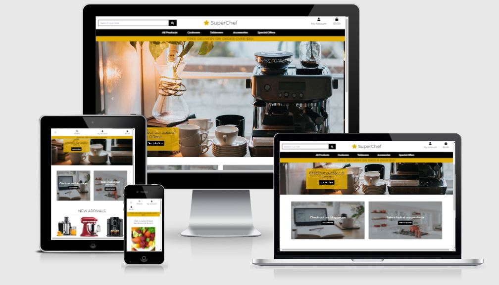
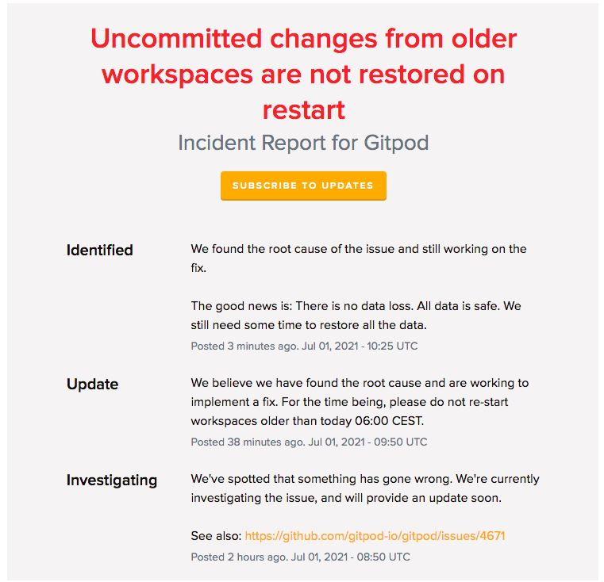
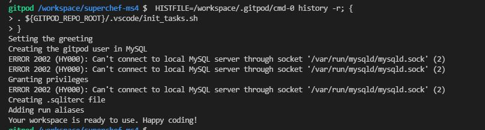
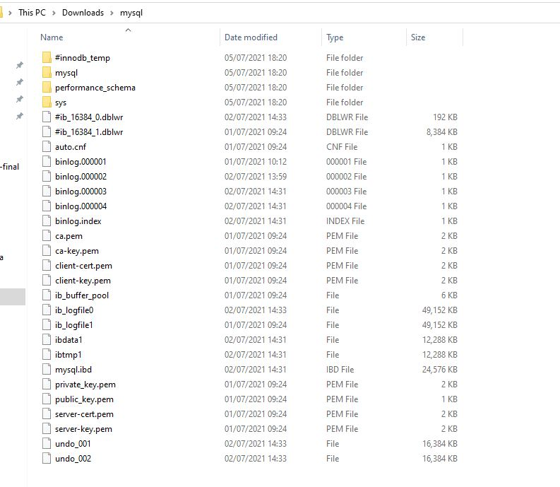

# SuperChef

### An E-commerce site for purchasing of Kitchen accessories.

[View live site here](https://superchef-ms4.herokuapp.com/)

This is my fourth and final milestone project for Code institute’s full stack web developer diploma. This project is a **Django web application** made with the use of **HTML**, **CSS**, **JavaScript** and **Python** and utilizing a relational database.
**Stripe** is also used for payment system.
This project is plugged into a **PostgreSQL** database, with **SQlite3** used in development and was deployed using **Heroku**. **AWS S3 bucket** is used to store static and media files. The **Bootstrap** framework and grid system was used for styling across the site.
***

## **Table of Content**

* [Overview](#overview)

* [User Experience](#user-experience)
    
    * [User Goals](#user-goals)
    * [Business Goals](#business-goals)
    * [User Stories](#user-stories)
    * [Business Stories](#business-stories)

* [Planes of Development](#planes-of-development)
    * [Strategy](#strategy)
    * [Scope](#scope)
    * [Structure](#structure)
    * [Skeleton](#skeleton)
        * [Wireframe](#wireframe)
        * [Sitemap](#sitemap)
    * [Surface](#surface)
        * [Color](#color)
        * [Core](#core)
        * [Buttons](#buttons)
        * [Typography](#typography)
        * [Images](#images)

* [Database model](#database-model)

* [Features](#features)
    * [Features Used](#features-used)
    * [Features to be implementd in Future](#features-to-be-implemented-in-future)

* [Technologies used](#technologies-used)
    * [Languages Used](#languages-used)
    * [Libraries, Frameworks and Editors](#libraries-frameworks-and-editors)
    * [Extensions and Kits](#extensions-and-kits) 
    * [Databases](#databases)
    * [Tools](#tools)

* [Bugs](#bugs)
    * [Project barriers and solutions](#project-barriers-and-solutions)
    * [Known Issues](#known-issues)

* [Testing](#testing)

* [Deployment](#deployment)
    * [Prerequisites](#prerequisites)
    * [How to Clone SuperChef](#how-to-clone-superchef)
    * [How to Deploy to Heroku](#how-to-deploy-to-heroku)

* [Credits](#credits)
    * [Code](#code)
    * [Media](#media)
    * [Acknowledgments](#acknowledgments)
***

## **Overview**

SuperChef is an online e-commerce store, which offers a collection of Kitchenware in many categories. 
User’s can create their own account, saving their details for faster checkout for future purchases, but are not limited to that,
and can make a purchase as a guest if wanted.
The registered user can edit their personal details and access their shopping history.
Blogs are presented for good reads and site owner can be contacted easily.

[Go Back to Top](#table-of-content)
***

## **User Experience**

### **User Goals**

1.	Somewhere to search for few things which user want to have and do the purchasing in easy steps.
2.	In the current pandemic situation, Users may want to do purchasing from the safe environment of their home.
3.	User-friendly website, where user don’t have to be very technically educated to do the purchasing.

### **Business Goals**

1.	During the current world situation, when everybody is spending most of the time inside and home cooking is the only option available, People want to get some useful kitchen products to help them in cooking and baking.
2.	A kitchenware website, where buyers can easily find the product according to their category.
3.	To make the product’s view based on many sorting types. For example, price- low to high, high to low. Rating- low to high, high to low. Etc.
4.	The Site owner will have full control over the products, He/She can add, edit and delete products.
5.	Site will have Blogs related to kitchen and cooking, for the better involvement of the user.

### **User Stories**

 | User Story ID   | As a/an     | I want to be able to  |  So that I can  |
| ------------- |:----------:| :------:|  :-----:  |
|    |       |    **Viewing and Navigation**         |    |
| 1 | Site User    | Immediately get an overview of what products this site offers |  Decide if it contains what I am looking for  |
| 2 | Shopper    | View a list of products |  Select some to purchase  |
| 3 | Shopper    | View details about a specific product |  See a detailed description, larger image, price and rating of the product  |
| 4 | Shopper    | See total of all items in my shopping bag |  avoid over expenditure  |
| 5 | Shopper    | See the rating of every product |  see other,s opinion about the product  |
| 6 | Site User    | View the blog about the site |  Learn more about the Superchef  |
| --- |  ---  | ---  |  ---  |
|     |     |  **Registration and User accounts**         |      |
| 7 | Site User    | Easily register for an account |  Have a personal account to come back and view my profile  |
| 8 | Site User    | Easily Login or Logout |  Access my personal account information  |
| 9 | Site User    | Easily recover my password in case i forget it |  Regain access to my account  |
| 10 | Site User    | Receive a confirmation email after registering an account |  Know that my account registration was successful  |
| 11 | Site User    | have a personalised user profile |  View my order history, see my order confirmation and save my payment information  |
| --- |  ---  | ---  |  ---  |
|     |      |   **Sorting and Searching**         |      |
| 12 |  Shopper    | Select which category of product to show |  Easily find a product within the category that I am interested in  |
| 13 | Shopper    | Sort products by different parameters |  Easily find the products with the best rating or lowest price  |
| 14 | Shopper    | Search for the product by name or description |  Easily find the specific product that I am looking to buy  |
| 15 | Shopper    | Easily see what I have searched for and the number of results |  Identify misspelling in my search string and quickly overview the search result.  |
| --- |  ---  | ---  |  ---  |
|      |      |    **Purchasing and Checkout**         |      |
| 16 |  Shopper    | Easily select the number of product when adding it to my shopping bag |  Ensure I do not accidently select the wrong product or quantity  |
| 17 | Shopper    | Easily view all items in my shopping bag |  Identifying the total cost and overview the items to be ordered  |
| 18 | Shopper    | Change the quantity of a product in my shopping bag |  To correct any mistake in the shopping bag before ordering |
| 19 | Shopper    | Easily enter my payment information |  Checkout easily and quickly  |
| 20 |  Shopper    | Know that my personal and payment information is secure |  Feel confident when providing the information needed to make a purchase  |
| 21 | Shopper    | To know if the payment is done successfully or failed |  Check my card validity  |
| 22 | Shopper    | View an order confirmation after checkout |  See that I have not made any mistake in my order |
| 23 | Shopper    | Receive a confirmation email after ordering |  Keep the information about what I have ordered and when, for future needs  |
| 24 | Registered User    | Have my address and billing information prefilled on the checkout page |  Checkout quicker  |
| --- |  ---  | ---  |  ---  |
|       |      |   **Admin and Store Management**         |       |
| 25 |  Superuser    | Add a product to the site |  Add new items to be sold in my store  |
| 26 | Superuser    | Edit/ Update a product |  Make changes of the products image and description when needed  |
| 27 | Superuser    | Delete a product  |  Remove Items when it is sold or out of stock |
| 28 | Superuser    | Add, Update and Delete blog posts |  Write and maintain a blog about product related topics  |

### **Business stories**

As the Site owner I want/expect/need:
1.	To display the products colourfully.
2.	To manage all the products featured in the site by editing and deleting as required.
3.	To manage the blogs posted by editing and deleting as required.
4.	The User can contact me easily through the contact form or they can find me on social media accounts.

[Go back to Top](#table-of-content)
  ***

## **Planes of Development**
### **Strategy**

The aim of making this site is to make a website that focuses mainly on kitchen products. 
There are plenty of sites right now but very few focuses only in kitchen tools and accessories. We are going through a pandemic and lockdown situation worldwide. We are bound to stay inside our home and left with very few activities, in that cooking is a good hobby to pursue.
 As we know new cooks are very keen to try new utensils and accessories, so this site might be a good place for them to search the product of their choice.

 ### **Scope**

 I want to make a website that is accessible to everyone. People can search and browse all the products without being registered, 
 so that their will be no hesitation in going through the site. Anyone can do the purchasing by adding his/her details and doing valid payment. 
 
 The detail of every product opens in new page with product rating with it, so it is easier to decide which product to buy. 
 
 Products can be sorted in various ways like price- low to high or high to low, category, ratings etc. users can make their profile, so that when they return back, they will have their details already filled.
Users can go through the blog page and write a comment if they want. And they can contact the site owner with the contact form provided.

### **Structure**

This website will be a multi-page site, where pages are connected through Navigation Bar or Python. 
The navigation bar will have links for the Home page, my account(login, register), bag, and Blog. The navigation links will change and show the logout and My profile Once the user is logged in. 
It will show product management link for the superuser.The navigation bar will be collapsible for Mobile view . 
There will be a footer, which will show the contact details of the admin. It will be sticky and always remain at the end of the page. 2 forms will be there, one for Login and the other for Registration. 
One contact form will also be there for the users to contact the admin. There will be pages for products, product details, shopping bag, checkout, checkout success, blog, blog details, Users will have a my profile page after the register with the site. Superuser will do the product management, he/she can add edit and delete any product. Superuser will post the blog which can be commented by any user .
SQLite3 is used in development and PostgreSQL database is used in production mode. All the static and media file will be stored in AWS s3 bucket it will be deployed by using Heroku.

### **Skeleton**
#### **Wireframe**
The wireframe for this project has been made for Three screen sizes(Mobile View, Tablet View, and Laptop View). Each page is shown in all three 
screen sizes for a better understanding of the responsiveness of the page.

The wireframes for this Project can be seen here.

1. [Home Page](docs/wireframes/HomePage.pdf)

2. [Products Page](docs/wireframes/ProductsPage.pdf)

3. [Product Details Page](docs/wireframes/ProductDetailsPage.pdf)

4. [Category Page](docs/wireframes/CategoryPage.pdf)

5. [My Profile Page](docs/wireframes/MyProfilePage.pdf)

6. [Login Page](docs/wireframes/LoginPage.pdf)

7. [Register Page](docs/wireframes/RegisterPage.pdf)

8. [Bag Page](docs/wireframes/BagPage.pdf)

9. [Checkout Page](docs/wireframes/CheckoutPage.pdf)

10. [Contact page](docs/wireframes/ContactPage.pdf)

11. [Blog Page](docs/wireframes/BlogPage.pdf)

12. [Blog Details Page](docs/wireframes/BlogDetailsPage.pdf)

13. [Product Management Page](docs/wireframes/ProductManagementPage.pdf)

#### **Sitemap**
Sitemap is prepared for this site to understand the navigation of the pages.

Sitemap can be seen here. [Sitemap](docs/wireframes/Sitemap.pdf)

### **Surface**
#### **Color**

The color used for this project are kept very minimum, so that the strong tonal varitaion provides a good contrast. The main color used for the project is Mustard yellow(#E1AD01), which goes very well with the kitchen theme and it is a good contrast with the other two colors Black(#000000) and White(#ffffff).

The colors used are:

Mustard Yellow color is used for delivery Banner and hover over across page. The Text color used are mainly black and changes to mustard yellow when hovered over.
The placeholder text for the form have color Cadet Blue(#AAB7C4) and rating text of the product description is Bootstrap text-muted class Slate Gray(#6C757d)

#### **Core**

The Core of the project is kept Black and White. The navbar is White and Main nav is Black, which has text written in white that changes to mustard yellow when hovered over. 
The Footer is Black with texts of white color. The social media links and Contact link changes to mustard yellow color when hovered over.
The pages of the project are kept white to make a good contrast with the products images.

#### **Buttons**

The Buttons are kept black with text white, which changes to mustard yellow when hovered over.
The edit and delete links have given a consistent coloue with the intuitative suggestions about their functions.
The edit is kept Dodger Blue(#007BFF) and Delete link is Amaranth(#DC3545)
The back to top button is Mustard yellow(#E1AD01)

*   `#000000` (Black)
*   `#007bff` (Dodger Blue)
*   `#DC3645`(Amaranth)
*   `#E1AD01`(Mustard Yellow)

#### **Typography**

[Montserrat](https://fonts.google.com/specimen/Montserrat?query=mon)

Google font **Montserrat** with a fallback of **sans serif** is selected for the entire project.

#### **Images**

Images used are taken from [Unsplash](https://unsplash.com/) and [Google](https://www.google.com). 

[Go back to Top](#table-of-content)
***

## **Database Model**

[Go back to Top](#table-of-content)
***

## **Features**

### **Features Used**
**Navigation Bar:**

All pages of the project have a fixed top navigation bar which has a search box, Site logo, and 2 icons, One is for *my Account* and another is *bag* icon.
The search box can be use to search by keywords of the product name or description. The My account icon is a dropdown list, which shows login and register links for the first time users. If the user has registered and logged in then then it will show a link to *my profile* and *logout* page. If the user is a superuser/admin then links to *Product management* and *Blog Management* are also visible. The bag icon takes us to *shopping Bag* page after clicking on it and it also displays the total amount of the products already in the bag. This section is fully responsive and in the mobile view the search box is replaced by only the icon of the search and search box appears after clicking on it. 
The navigation bar consiste of one **Main Nav** also, which is a list of all the categories of the products used in the project. These list have links based on price and rating of the product also. This section changes to a collapsible hamburger menu on the left side of the screen for the smaller screen view. 
There is one delivery banner also which displays the message about the free delivery threshold for the project.

**Footer:**

The Footer is a *Sticky Footer* , which is visible in every page of the project. The footer has 3 sections, one is the copyright information about the site owner, second is the font awesome icons of the social media *Facebook*, *Twitter*, and *Instagram*. The links takes the user to the respective sites after clicking on it.
The third section is a *Contact Us* link, which opens the contact form after clicking.

**Index page:**

The Index page or landing Page is divided in 3 sections. First section has a Carousal with 3 images. Each image has a cover text which has some information and a button to take the user to the relative page.
Second section has 2 cards, one is a image of a blog and a button to take the user to the **Blog** page and second is an iamge of kitchen and a button to go to The main Product page.
Last section has a **Special Offer** section which displays the iamges of special offer category products and a *See All* link to take the user to the special offer section. The product images are also clickable and takes the user to the product description page.

**Products page:**

Products can be viewed in many different ways. The product is displayed in the form of a card, which has *product image*, *product price*, *product category*(which is also a clickable badge to take the user to that category), *product rating* and *edit and delete* button. 
Product Image takes the user to Product detail page when clicked. Edit and delete button are only visible to the superuser.
This page also has a sort button which displays the products in that specific sort order (Price(low to high), Price(high to low), Rating(low to high), Rating(high to low), Name(A-Z), Name(Z-A), Category(A-Z) and Category(Z-A)).

**Product Detail page:**

Product Detail page has Image of the product on left side, which is clickable and opens the product image in a new tab. Left side of the page has *product name*, *product price*, *product rating*, *category*, *edit /delete* button(for superuser), *product description*, *quantity selector*, and 2 buttons, one for *keep shopping* and another for *Add to bag*.

**Product Management Page:**

Product management page opens after clicking the product management link in the my profile dropdown in navbar. this link is only visible to the admin. This page can be used to add or edit new products. The add products page opens with a form to select the category in the dropdown menu, Place to write 'sku', 'name', 'description' 'price', 'rating', 'image url' and a button to select the image. Two buttons are given, one to cancel the action and another to add the product. When the admin selects the edit action the page will open with advance populated with the product information and detail. Product image is also visible to take better decision. This image section is made with django widgets for better user experience. Two buttons are given to edit or cancel the action. After adding or editing the product, product detail page opens. 

**Profile page:**

The profile page can be accessed by the **My account** link in the navbar. This page is divided in 2 sections. One is having a information form, which is empty in the beginning and get filled automatically after user enters its information in checkout page. There is an *Update Information* button in the end, for the user to change any detail if he wants. 
The second section is *Order History* list, which displays the orders placed by The user. It shows *Order Number*, *date*, *Item name* and *Order Total*.
The Order Number shows only 5 digits in the form but when clicked it opens the page of **order history**.

**Order history:**

This page can be accessed by the profile page and clicking on the order number. The order history page shows *order info* (order number and order details), *order details* (item name and price), *Delivering To* (Full name, Address1, Address2, County, Town or city, Postal Code, Country Phone Number), *Billing Info* (order total, delivery and Grand Total). There is a *Back to Profile* button at the end whish takes back to the profile page.

**Shopping Page:**

The shopping page can be viewed by clicking the bag icon on the navbar. The shopping page shows the details of the products added by the user in his/her bag. It shows *product info* (product image, product name and sku), *Price*, *Quantity selector box* , and *Subtotal*. There are 2 buttons given below the quantity selector, one is *update* button, to increase or decrease the quantity of the product and another is *remove* button, to remove the item from the bag.
This page shows *Bag total*, *Delivery cost* and *Grand Total* also. If the discount threshold is not reached then one message will show about how much to spend more to reach that threshold. There are 2 buttons given in the bottom, one for keep shopping and another for secure checkout.

Thia page looks different in mobile view, where *Bag total*, *Delivery cost* and *Grand Total* are at the top of the page. And one *back to top* button is also added in case user has multiple products and page becomes very long. 

**Checkout Page:**

The checkout page can be viewed by clicking secure checkout button on the shopping bag page. The checkout page is divided in two sections horizontally. First one is having the details of the customer 'full name', 'email address', 'phone number', 'address', 'county', 'postal code', and a dropdown selection for the country. One more box is given to enter the card number. If the user is not logged in then one information will display to tell the user to login to save this information and if the user is not registered then he/she can use create account link to register. two buttons are given at the bottom, one to *adjust bag* and another to *complete order*.
Below the buttons the total purchase amount is shown in red color.
The second section of the checkout page shows the *order summary* of the order placed by the user. It displays product image, product name, sub total, delivery, grand total.

**Checkout Success Page:**

This page can be viewed by clicking *Complete Order* button on the checkout page, This page is same as *order history* page. 

**Blog Page:**

Blog is created to view by every user. It can be accessed by any user by clicking the blog link on home page. The blog page shows rows of all the blogs. Every row have one blog image, Name of the blog, Name of the person who added the blog, Date and time of blog added, And first 150 characters of the blog details. There is a *read more* button the open the blog in the different page for a full view. The image of the blog will also open the blog in the detail view. There is one edit and delete link, only visible to the superuser. In mobile view the blog image will take the full width and blog name and other details will come below the blog.

**Blog Deatils Page:**

Blog details page can be opened by clicking the blog name or image or read more button on blog page. This page contains a big blog image and full blog detail. There is a back to blog button given at the end of the blog detail, which takes back to main blog page.

**Blog Comments section:**

One comment section is added at the blog detail page after the back to blog button. In this comment section, anybody can Enter their name and email id and Add their comments and submit through ta submit button. The comments needs approval by the Admin. This feature is added for the safety reasons to avoid any spam or unacceptable comments. After the approval the comment is visible with the person's name, date and time of the comment.

**Blog Management Page:**

The blog management page is visible only to the admin byt clicking the blog management link in my profile dropdown in the navbar. The blog management page is made to add new blogs or edit existing blogs easily and without opening the django admin page. This page has 'Blog name', 'Slug', 'Author', 'body', button to select the image or a space to add the image url. Status can be selected between *draft* or *publish*. Two buttons are given, one to cancel the action and another to add the blog. after adding blog detail page opens. When the admin select the edit action for the blog, the page opens with populated with the blog information in advance. Blog image is also visible. The blog image section is made using widgets of django which gives a very good user experience. The admin will have an option to cancel the action or update the blog.

**Back to top button:**

A back to top button is visible on product and bag pages when the user scrolls past 200 pixels.

**Contact Page:**

The contact page can be opened by clicking th contact us link on the footer. This page has a feedback form for the user to enter 'name', 'email', 'subject' and the 'message'. One button is given to send the message. The message directly goes to admin's email account.

**Toasts:**

All pages displays toast messages depending on the action taken. Toast messages are of 4 types, 'success', 'error', 'warning', and 'info'. The toast colour also changes according to the message. Toast is displayed at the top right of the page below the navbar. There is a button is the toast to go to secure checkout.

**Delete Modal:**

The delete modal is added as the safety of the site. The admin can delete the products and blogs but while doing that one delete modal pops up asking for the confirmation about the action. If the admin is sure to delte then he/she clicks the delete button or if not sute then click cancel and go back to open page.

### **Features to be implementd in Future**

There are pleant of features that can be added in the project in the future as django gives multiple opportunities and options. 

1. Account login via social media
 
 I wanted to add Gmail or facebook login in the project but due to some factors I could not do that. I would love to do that in the future after getting more knowledge in Django.

2. Product Review

 It would be great if the user get to know what other people think about a particular product. I would love to do that in the future.

[Go back to Top](#table-of-content)
***

## **Technologies used**

### **Languages Used**

* [HTML](https://en.wikipedia.org/wiki/HTML) is the main language used to write code for this project.
* [CSS](https://en.wikipedia.org/wiki/CSS) is used to write code for designing and beautifying the site.
* [JavaScript](https://en.wikipedia.org/wiki/JavaScript) is used to add functionality and make the site more interactive.
* [Python](https://en.wikipedia.org/wiki/Python_(programming_language)) is used for the Backend Programming.
  * [jinja](https://en.wikipedia.org/wiki/Jinja_(template_engine)) is used as the template engine for Python.

### **Libraries, Frameworks and Editors**

 * [Django](https://www.djangoproject.com/) is a Python Web Framework, which is used for development.
 * [AWS S3](https://aws.amazon.com/s3/) cloud storage for static and media files.
 * [VS Code](https://code.visualstudio.com/) main workspace IDE(integrated Development Environment).
 * [jQuery](https://jquery.com/) was used for the interactive features.
 * [Bootstrap](https://getbootstrap.com/) is used to make main structure and layout of the project.
 * [Google Fonts](https://fonts.google.com/) was used for the font 'Montserrat' for this project .
 * [Font Awesome](https://fontawesome.com/) is used to import Social media icons to beautify the footer, and icons for bag and user in every page.
 * [GitHub](https://github.com/) is used to make **Repositories** and for **Version Control**.
 * [Git](https://git-scm.com/) was used for version control by making use of the gitpod terminal to add, commit and push to github..
 * [Heroku](https://www.heroku.com/about) was used for deploying the app.
 * [Unsplash](https://unsplash.com/) was used to get imagesfor background and blogs.
 * [Google Images](https://www.google.com/) was used to get images for the products.

### **Extensions and Kits**

 * [Django allauth](https://django-allauth.readthedocs.io/en/latest/) was used as authentication system.
 * [Django Crispy Forms](https://django-crispy-forms.readthedocs.io/en/latest/) was used to format forms.
 * [Pillow](https://pillow.readthedocs.io/en/stable/) Python imaging library to help store imagery into a database.
 * [psycopg2](https://pypi.org/project/psycopg2/) PostgreSQL database adapter for the Python.

### **Databases**

 * [Sqlite 3](https://www.sqlite.org/index.html) Used as development database.
 * [PostgresSQL](https://www.postgresql.org/) used as the database for deployment.

### **Tools**

 * [Stripe](https://stripe.com/ie) used as as the payment infrastucture to take payments on the site.
 * [Am I Responsive?](http://ami.responsivedesign.is/) is used to take a mockup screenshot of the project, which is attached at the beginning of this document.
 * [Autoprefixer](https://autoprefixer.github.io/) is used to make the site compatible with all browsers.
 * [iColorpalette](https://icolorpalette.com/) is used to find a relevant color palette for the site.
 * [W3C Validator](https://validator.w3.org/) is used for testing HTML and CSS for the site.
 * [JSHint](https://jshint.com/) is used for testing javascript code for the site.
 * [PEP8 online](http://pep8online.com/) is used for testing Python codes.
 * [Online Spelling Check](https://www.grammarly.com/), Grammarly is used to check spelling and grammatical errors.
 * [Snipping Tool](https://en.wikipedia.org/wiki/Snipping_Tool) was used to take screenshots of the images and codes.
 * [TinyPNG](https://tinypng.com/) is used to reduce the size of the Hero Image.
 * [Balsamiq](https://balsamiq.com/wireframes/) is used to make wireframes for this project in the skeleton stage.

[Go back to Top](#table-of-content)
***

## **Bugs**

### **Project barriers and solutions**

* While making the index.html page for Home app, I tried to show background images by adding them in media folder, but it was not working. It was working fine when i tried to add the images from static folder. I checked every spelling error in settings.py and project level urls.py file, but I could not find any mistake. I searched in [Django documentation](https://docs.djangoproject.com/en/3.2/) also to check if the code is correct. I found that the code is correct. So, I searched in slack for some related issues and I found one suggestion from a member to add one code in settings.py's context_processor. I tried that code and images started loading perfectly. the code used was 
        
        'django.template.context_processors.media',

* Blog and comments on blog are the 2 extra models which were decided by me to add in the project. Adding Blog , Editing it and Deleting dunctions worked fine but when I added comment model and wrote view for it, the blog detail section started giving error, those errors were unfamiliar to me. So, i contacted Tutor support but could not get any help from there. So I started going line by line and trying to understand it and I found that my comment variable in database has no connection with the blog variable in the view. So, I made the correction and after few trial the view started working. The line which was written wrong and then corrected was 

         'new_comment.post = blog'

* The biggest project barrier came on the day of deployment, On 1st july 2021 Gitpod had some incident which dleted all uncommited files from every workspace open during that time. My workspace was open as I was going to do deployment. The workspace stopped working and We got instructions from Gitpod.

  

I lost my SQL database after that incident, 

  

Gitpod sent me .tar files which was very complicated to read and implement for me.

  

So I install the requirements again, Did the migrations and uploaded Categories, Products and Blogs again.
### **Known Issues**

[Go back to Top](#table-of-content)
***

## **Testing**

[Go back to Top](#table-of-content)
***

## **Deployment**

[Go back to Top](#table-of-content)
***

## **Credits**

[Go back to Top](#table-of-content)
***

